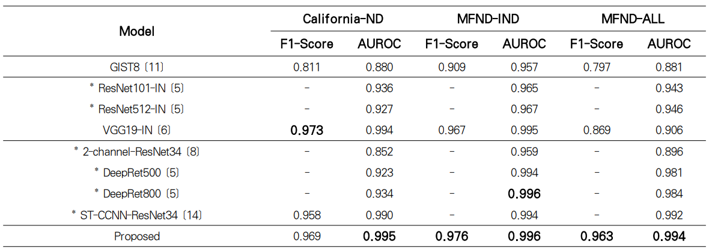
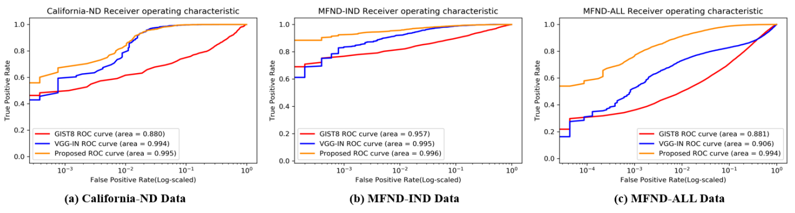

# Near-Duplicate-Image-Detection-Using-a-Self-Supervised-Learning-Model

양희성 and 박혜영 (2022). 자기 지도 학습 모델을 사용한 중복 이미지 탐지. 한국차세대컴퓨팅학회 논문지, 18( 3), 75- 84. (http://doi.org/10.23019/kingpc.18.3.202206.007)

# Abstract

Near-duplicate image detection is a find image pairs that satisfy some predefined conditions on image duplication. To solve this problem, deep learning techniques for image analysis are being used actively. The conventional approaches mainly use supervised learning methods for classification tasks, which needs appropriate supervised signals such as class labels. Also, it is difficult to have sufficient generalization performance when the domain of input images is not limited to a specific group. Considering these difficulties, this paper proposes a method for near duplicate image detection by extracting image features using a self-supervised model, which has recently been attracting attention, and comparing distances between the features. We conduct comparative experiments with other models using California-ND data and MIR-Flickr Near Duplicate (MFND) data, and confirm that our method achieves the state-of-the-art performance.

# Results

# Acknowledgements

1. 이 논문은2021년도 정부(과학기술정보통신부)의 재원으로 정보통신기획평가원의지원을 받아 수행된 연구임(No.2022-0-5 02068, 인공지능 혁신 허브 연구 개발)

2. 본 논문(저서)은 교육부 및 한국연구재단의 4단계 BK21 사업 (경북대학교 컴퓨터학부 지능융합 소프트웨어 교육연구단)으로 지원된 연구임(4199990214394)